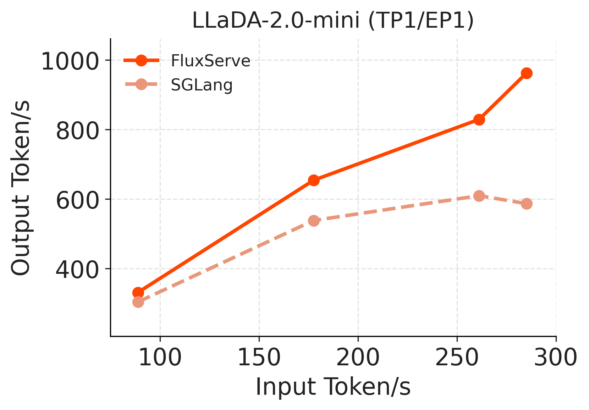
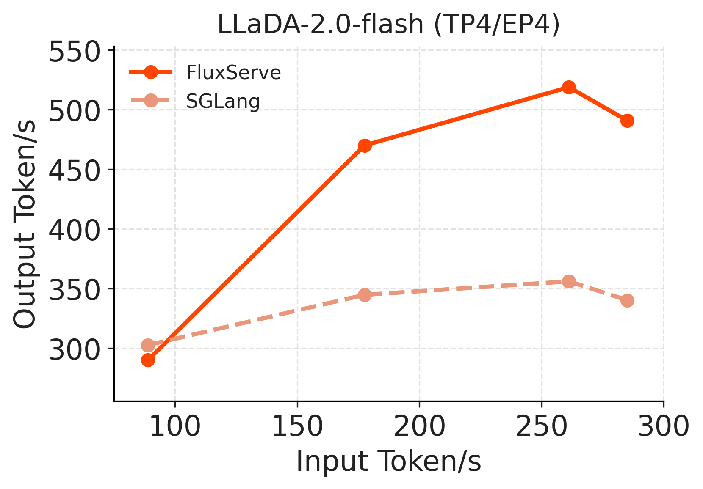

  

--------------------------------------------------------------------------------

## About
**FluxServe** is a lighweight and high-performance serving engine for diffusion langauge models. It is designed and implemented to deliver low-latency and high-throughput inference for autoregressive (AR) diffusion models across different setups, ranging from single GPU batched inference to multi-GPU distributed serving.

Its core features include:

- **Block Causal Attention**: Provides efficient attention runtime with a block-casual attention mechanism suitable for AR diffusion in real-world scenarios, including *varlen prefill* and *varlen block-deocde* with CUDA graph support.
- **Dynamic Scheduler**: Provides scheduler with efficient C++ control plane and Python execution plane with fine-grained block-level request management suitable for block diffusion models.
- **Multi-GPU Serving**: Provides tensor paralllel (TP), data parallel (DP) and expert parallel (EP) support for large-scale models.

## [Getting Started](docs/guides/getting_started.md)

## [Development Roadmap](docs/roadmap.md)

## Performance Results
On GSM8K dataset, FluxServe reaches **960 output tokens/s** with LLaDA-2.0-mini (TP1/EP1) and **520 output tokens/s** with LLaDA-2.0-flash (TP4/EP4), offering up to 60% more throughput compared to SGLang-dLLM.

<table>
  <tr>
    <td align="center" width="50%">
      
    </td>
    <td align="center" width="50%">
      
    </td>
  </tr>
</table>

## Acknowledgments
We learned the system design and reused code from the following projects: [vllm](https://github.com/vllm-project/vllm), [SGLang](https://github.com/sgl-project/sglang), [TokenSpeed](https://github.com/lightseekorg/tokenspeed), and [dInfer](https://github.com/inclusionAI/dInfer).
