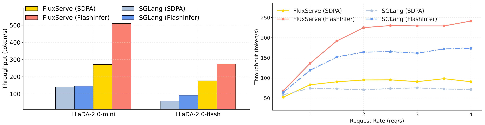

  

--------------------------------------------------------------------------------

## About
**FluxServe** is a lighweight and high-performance serving engine for diffusion langauge models. It is designed and implemented to deliver low-latency and high-throughput inference for autoregressive (AR) diffusion models across different setups, ranging from single GPU batched inference to multi-GPU distributed serving.

Its core features include:

- **Block Causal Attention**: Provides efficient attention runtime with a block-casual attention mechanism suitable for AR diffusion in real-world scenarios, including *varlen prefill* and *varlen block-deocde*.
- **Dynamic Scheduler**: Provides scheduler with efficient C++ control plane and Python execution plane with fine-grained block-level request management suitable for block diffusion models.
- **Multi-GPU Serving**: Provides tensor paralllel (TP), data parallel (DP) and expert parallel (EP) support for large-scale model, such as llada-2-flash.

## [Getting Started](docs/guides/getting_started.md)

## [Development Roadmap](docs/roadmap.md)

## Performance Results

### Batched Inference
FluxServe achieves up to 4.5x speedup against SGLang in offline batched inference on the GSM8K dataset. The results are reported using batch size of 16, output length of 2048 on 4 x GH200 with TP=EP=4.
<table align="center">
  <tr>
      
  </tr>
</table>

### Online Serving
FluxServe also can sustain up to 40% more throughput when serving 100B LLaDA-2.0-Flash. Detailed benchmark guides can be found [here](docs/guides/benchmark.md).
<table align="center">
  <tr>
      
  </tr>
</table>

## Acknowledgments
We learned the system design and reused code from the following projects: [vllm](https://github.com/vllm-project/vllm), [SGLang](https://github.com/sgl-project/sglang), [TokenSpeed](https://github.com/lightseekorg/tokenspeed), and [dInfer](https://github.com/inclusionAI/dInfer).
