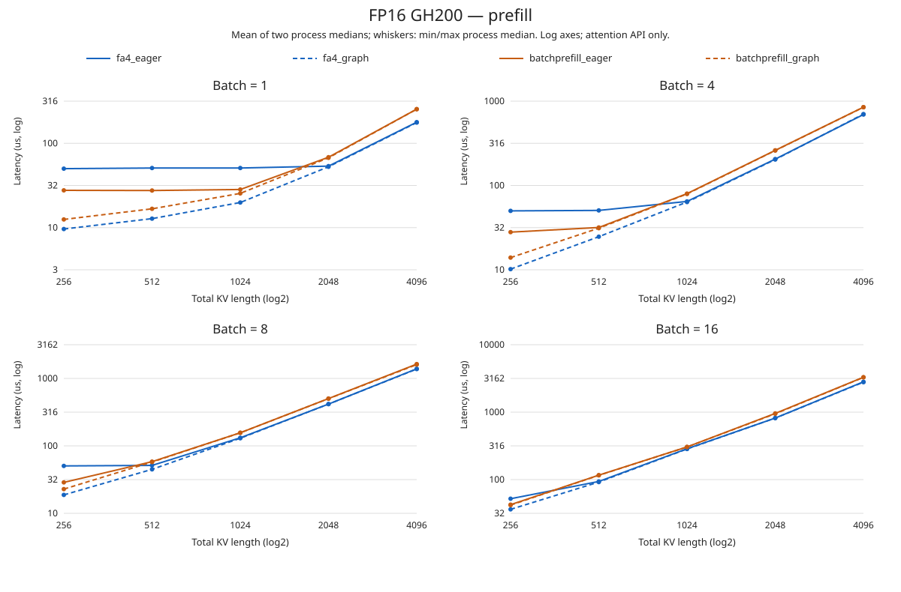
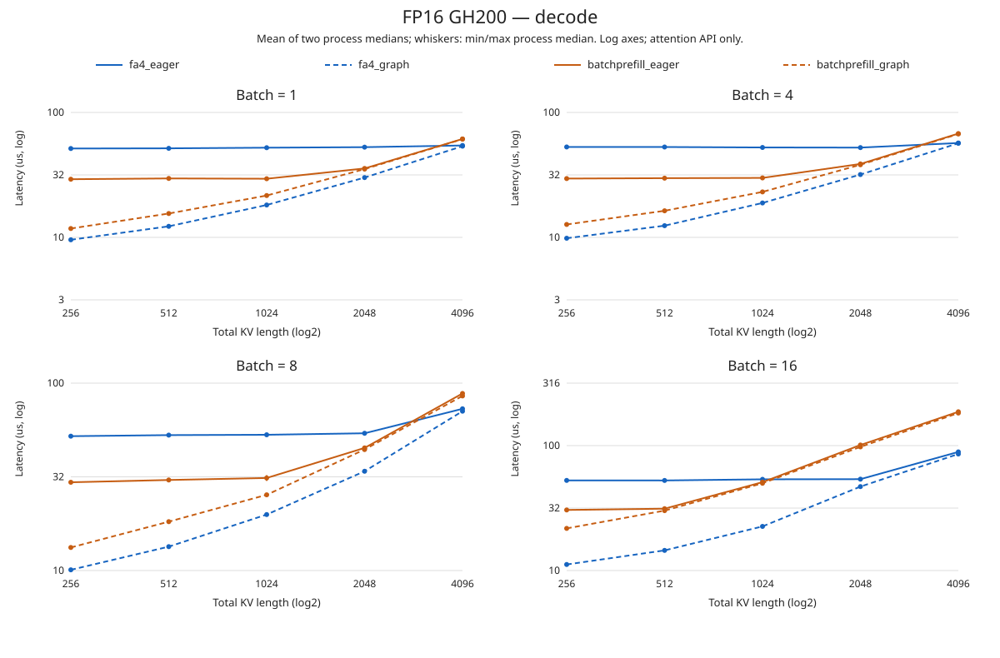

# Expanded FP16 measured results

Generated from 84 JSON records: 42 cases × 2 independent process passes.
Values: mean of the two process medians, in microseconds. Each process median is over 12 round averages, not individual-call latencies.

| Case | FA4 eager | FA4 graph | BatchPrefill eager | BatchPrefill graph |
|---|---:|---:|---:|---:|
| prefill_b1_kv256 | 50.05 | 9.62 | 27.68 | 12.50 |
| prefill_b1_kv512 | 50.91 | 12.78 | 27.55 | 16.72 |
| prefill_b1_kv1024 | 50.94 | 19.85 | 28.33 | 25.46 |
| prefill_b1_kv2048 | 53.62 | 52.67 | 68.42 | 67.31 |
| prefill_b1_kv4096 | 178.20 | 176.24 | 254.37 | 254.10 |
| prefill_b4_kv256 | 49.97 | 10.18 | 27.96 | 13.94 |
| prefill_b4_kv512 | 50.59 | 24.67 | 31.74 | 31.16 |
| prefill_b4_kv1024 | 64.68 | 63.58 | 80.03 | 79.32 |
| prefill_b4_kv2048 | 205.52 | 203.27 | 260.96 | 259.87 |
| prefill_b4_kv4096 | 694.41 | 702.69 | 849.36 | 847.34 |
| prefill_b8_kv256 | 50.45 | 18.75 | 28.76 | 22.85 |
| prefill_b8_kv512 | 51.32 | 44.88 | 58.34 | 57.62 |
| prefill_b8_kv1024 | 131.77 | 129.80 | 156.51 | 156.14 |
| prefill_b8_kv2048 | 416.68 | 416.43 | 502.95 | 501.36 |
| prefill_b8_kv4096 | 1389.50 | 1377.66 | 1632.14 | 1604.47 |
| prefill_b16_kv256 | 52.05 | 36.21 | 42.49 | 41.86 |
| prefill_b16_kv512 | 93.84 | 91.89 | 116.40 | 115.72 |
| prefill_b16_kv1024 | 286.77 | 284.35 | 305.07 | 304.40 |
| prefill_b16_kv2048 | 817.71 | 817.03 | 958.03 | 946.60 |
| prefill_b16_kv4096 | 2817.81 | 2784.82 | 3295.70 | 3280.86 |
| decode_b1_kv256 | 51.44 | 9.57 | 29.21 | 11.77 |
| decode_b1_kv512 | 51.62 | 12.26 | 29.63 | 15.52 |
| decode_b1_kv1024 | 52.22 | 18.16 | 29.47 | 21.62 |
| decode_b1_kv2048 | 52.74 | 30.11 | 35.63 | 35.19 |
| decode_b1_kv4096 | 54.40 | 53.72 | 61.36 | 61.17 |
| decode_b4_kv256 | 52.93 | 9.84 | 29.57 | 12.69 |
| decode_b4_kv512 | 52.89 | 12.41 | 29.78 | 16.32 |
| decode_b4_kv1024 | 52.44 | 18.86 | 29.92 | 23.12 |
| decode_b4_kv2048 | 52.32 | 31.83 | 38.72 | 38.13 |
| decode_b4_kv4096 | 56.95 | 56.66 | 67.75 | 67.27 |
| decode_b8_kv256 | 52.12 | 10.09 | 29.58 | 13.28 |
| decode_b8_kv512 | 52.80 | 13.41 | 30.42 | 18.23 |
| decode_b8_kv1024 | 53.02 | 19.90 | 31.18 | 25.36 |
| decode_b8_kv2048 | 54.01 | 33.87 | 45.13 | 44.25 |
| decode_b8_kv4096 | 72.97 | 70.85 | 88.11 | 85.45 |
| decode_b16_kv256 | 52.65 | 11.18 | 30.55 | 21.75 |
| decode_b16_kv512 | 52.61 | 14.50 | 31.27 | 30.17 |
| decode_b16_kv1024 | 53.72 | 22.56 | 51.01 | 49.95 |
| decode_b16_kv2048 | 53.88 | 46.98 | 101.08 | 97.69 |
| decode_b16_kv4096 | 89.06 | 85.67 | 186.60 | 182.23 |
| prefill_mixed | 53.43 | 28.58 | 43.87 | 43.12 |
| decode_mixed | 120.85 | 118.84 | 192.23 | 191.79 |

All correctness gates passed; maximum absolute FP32 SDPA error: 0.000732422.

Whiskers are the range of two process medians, NOT confidence intervals. Raw per-round variability remains in JSON.
