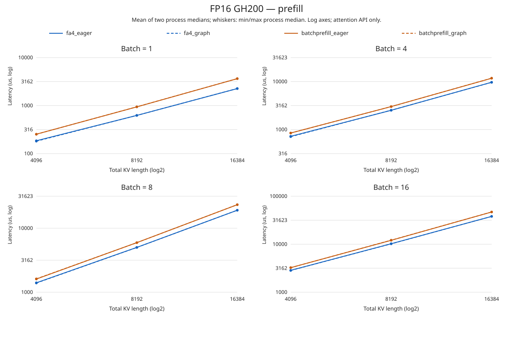
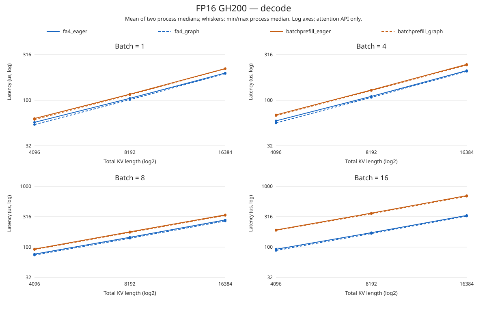

# FP16 long-KV recheck

This extends the [earlier sweep](fa4_llada_size_sweep.md) to KV=8192 and
16384, with KV=4096 remeasured as an anchor in the same allocation.
GH200 job 3092310; batches 1, 4, 8, 16; prefill and 64-token block decode.
The 24 cases run in two independent processes, reversing case order on pass 1.
Every case compares FA4/BatchPrefill × eager/graph with shared FP16 Q/K/V.
Hq/Hkv/D=16/4/128 and block/page=64 remain unchanged.

## Measurement scope

Each method gets 100 warmup calls and 0.5 seconds of synchronized warmup.
Each of 12 rotated timing rounds measures 20 calls (rather than the earlier
100, to bound long-prefill runtime). This change applies equally to all four
methods, including the 4096 anchor. Do not splice this job's absolute times
into the old curves as if they were one controlled run.

All-query FP32 math SDPA checks, eager/graph equality after two Q updates,
JIT, planning and capture are outside timing. The measured scope remains
attention API only: reused inputs/cache, continuous queued CUDA-event timing,
no full adapter, model, request scheduler or per-request synchronization.
Clocks are not locked. Two process medians provide a repeatability check,
not a statistical confidence interval or proof of a bottleneck mechanism.

## Interpreting eager/graph convergence

All 48 records completed on `gh003.hsn.cm.delta.internal.ncsa.edu`.
All FP32 SDPA and changed-Q graph parity checks passed; maximum absolute
SDPA error across both backends and all cases was 0.000545382.

Representative B=16 results, mean of two process medians, microseconds:

| Phase | KV | FA4 eager | FA4 graph | Graph latency reduction |
|---|---:|---:|---:|---:|
| Prefill | 4096 | 2856.10 | 2839.26 | 0.59% |
| Prefill | 8192 | 10239.41 | 10184.90 | 0.53% |
| Prefill | 16384 | 37999.36 | 38003.64 | -0.01% |
| Decode | 4096 | 92.10 | 87.99 | 4.46% |
| Decode | 8192 | 172.71 | 167.09 | 3.25% |
| Decode | 16384 | 331.76 | 323.64 | 2.45% |

These measurements support convergence, not universal equality: long prefill
has negligible gain here, while long decode retains a few percent. For
BatchPrefill at B=16/KV=16384, prefill is 46942.42/46952.33 us (eager/graph),
and decode is 703.06/685.50 us; the same broad distinction is visible.

For these queued measurements, host submission and device execution can
overlap. A useful qualitative model is that sustained time per call follows
the slower of host submission and GPU execution, rather than their simple
sum. Graph reduces submission work but does not remove QK, softmax or AV.
When GPU execution dominates, eager and graph can converge even though graph
still saves CPU work. This is consistent with the earlier size trends; it is
not evidence that CUDA API overhead literally becomes zero.

Prefill Q length grows with KV, producing roughly quadratic attention-pair
growth at fixed batch size. Decode here holds Q=64 and grows only the prefix,
so pair growth is linear in KV. Neither scaling formula alone predicts exact
runtime: parallelism, cache behavior and kernel configuration also matter.
Small differences can have either sign; graph is not guaranteed to be faster.

This does not establish that full-model CUDA Graph is ineffective: a model
contains other kernels and dispatch boundaries absent from this single-attention
benchmark. Optimization priorities for this measured long-attention path should
focus on device work; full-runner graph benefits require a separate end-to-end test.

See [measured tables and line plots](fa4_fp16_long_kv/fa4_fp16_expanded_results.md).





## Reproduction

Run inside the configured FA4 GPU environment:

```bash
for pass_id in 0 1; do
  python test/runtime/integration/sweep_fa4_llada.py \
    --pass-id "$pass_id" --lengths 4096 8192 16384 --iterations 20 --no-mixed \
    --output-dir test/runtime/integration/profiles/fa4_llada_fp16_long_kv
done
python3 test/runtime/integration/plot_fa4_llada_sweep.py \
  test/runtime/integration/profiles/fa4_llada_fp16_long_kv \
  docs/fa4_fp16_long_kv --lengths 4096 8192 16384 --no-mixed
```

Raw per-round samples, dtype, host, geometry and correctness results are
retained in the JSON directory above. Older results are preserved separately.
