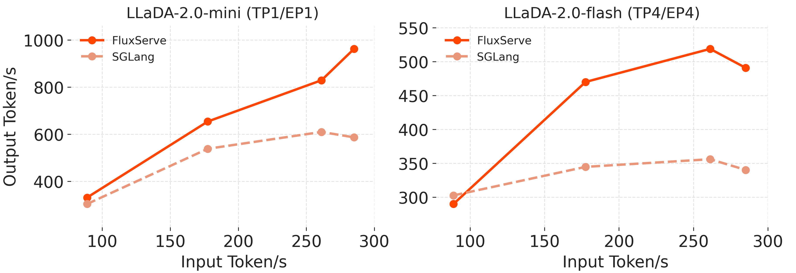

# Benchmarking

## Offline Benchmark
FluxServe supports offline throughput benchmarking with JSONL input files. Complete the [Docker installation](getting_started.md) first and run the examples from the FluxServe repository directory.
```bash
fluxserve bench_offline \
  --model inclusionAI/LLaDA2.0-mini \
  --dataset ./data/humaneval.jsonl \
  --tp-size 1 \
  --dp-size 1 \
  --ep-size 1 \
  --batch-size 4 \
  --gen-len 512 \
  --block-length 64 \
  --use-decode-cuda-graph
```

## Online Benchmark

1. Launch FluxServe engine

```bash
fluxserve serve \
  --model inclusionAI/LLaDA2.0-mini \
  --host 127.0.0.1 \
  --port 8000 \
  --tp-size 1 \
  --dp-size 1 \
  --ep-size 1 \
  --max-num-seqs 4 \
  --max-model-len 4096 \
  --block-length 64 \
  --threshold 0.95 \
  --parallel-decoding threshold \
  --attention-backend flashinfer \
  --kv-cache-layout paged \
  --scheduler-policy paged \
  --use-decode-cuda-graph \
  --cuda-graph-decode-mode padded \
  --cuda-graph-capture-bs 1 2 4 
```

2. Check server health
```bash
curl -fsS http://127.0.0.1:8000/health
```

3. In another shell, run the benchmark client against the running server.
```bash
fluxserve bench serve \
  --model inclusionAI/LLaDA2.0-mini \
  --dataset ./data/humaneval.jsonl \
  --dataset-output-len 512 \
  --request-rate 1 \
  --max-concurrency 32 \
  --metric-percentiles 50,90,99
```

## Published performance figure

The following figure is reproduced from the FluxServe repository at the source revision linked on this page. It compares decode throughput for LLaDA2.0 Mini and Flash on GSM8K and BigCodeBench across request rates.



These are project-reported results, not measurements from building this website. The figure alone does not specify the complete hardware, software, and decoding configuration needed to reproduce it. Use the commands above to measure your own environment; do not infer a universal speedup from these curves.
